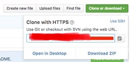
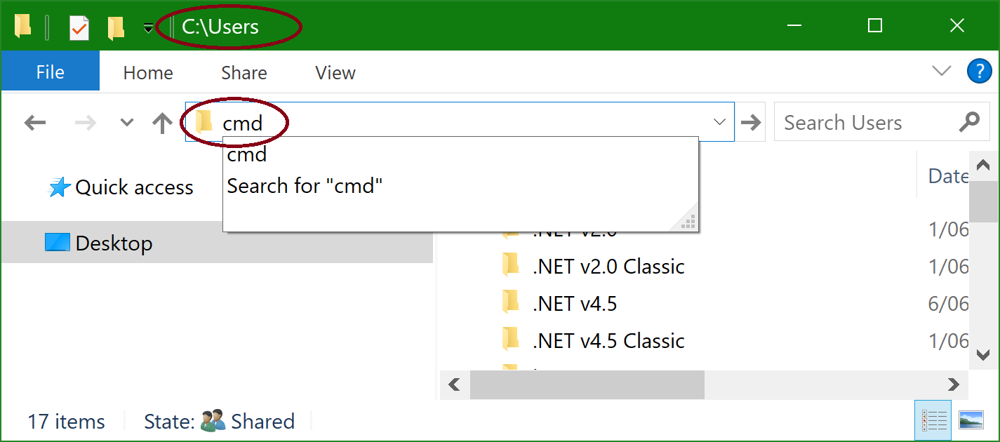
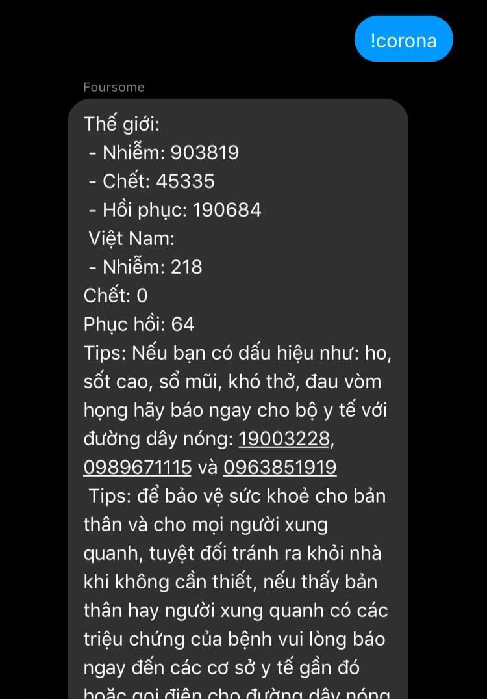

# Sumi-chan-bot

**Bot Sumi-chan Version 2.0.7 (Hoạt động tốt hơn trên server)**

**Update ngày 9/4/2020**

 - lượt bỏ !jav
 - lượt bỏ khen sumi
 - lượt bỏ ping sumi
 - thêm !sumi
 - thêm !report
 - thêm !wiki
 - thêm !getname
 - thêm !ping
 - sửa lại !help
 - fix một số bug ngoài ý muốn
 - tối ưu code hoạt động nhanh hơn
 
**Cập nhật ngày 12/4/2020**

 - lượt bỏ !play
 - lượt bỏ !music
 - sửa chữa !wiki -> sử dụng google api search
 - thêm !youtube -s
 - thêm !youtube -m
 - thêm !youtube -v
 - thêm !update
 - thêm mục "lệnh dành riêng cho youtube"
 - to do list:
  + hentaivn search
  + ....

 
**Update ngày 15/4/2020**

 - Phân chia lại source code (Khá gọn) 
 - thêm fact mỗi ngày
 - thêm random ảnh về anime
 - thêm !update
 - thêm !đấm
 - thêm !hentaivn
 - thêm !facebook -p
 - sửa lại !wiki => trả về kết quả nhanh hơn bao giờ hết, sử dụng api wikipedia
 - sửa lại !sim => trả về kết quả nhanh hơn bao giờ hết
 - sửa lại !weather
 - sửa lại !waifu => giải quyết trường hợp lâu không thấy phải hồi
 - sửa lại !echo => ngăn lỗ hổng lệnh admin
 - sửa lại !rank => rank card nay đã trống hơn phục vụ cho mục đích tương lai
 
**Update ngày 17/4/2020**

 - Sửa cronjob hằng ngày
 - cho !hentaivn ra rìa
 - tối ưu code
 - chả nhớ đã làm gì nữa 🤔
 - thêm !ping url
 - thêm !boostrank
 - thêm !reset
 - sửa !rank (thanks Trịnh Huy Nam)
 
 
Để lấy toàn bộ lệnh của bot bạn có thể sử dụng lệnh !help hoặc đọc ở bên dưới cái readme này!

Để có thể sử dụng bot, bắt buộc bạn phải cài nodejs và npm, và một tài khoản facebook có bật 2 lớp bảo mật theo nhận mã và đã tạo trên 3 tháng. Sau đây là hướng dẫn:

•Step 1: bạn phải clone hoặc download Sumi-chan này về, nếu máy bạn có git hãy sử dụng lệnh:
```
git clone https://github.com/roxtigger2003/Sumi-chan-bot
```
hoặc ở trên góc phải có nút xanh ghi là clone or download bạn nhấn vào chọn download zip là nó tự download file zip về và unzip ra nha :3


•Step 2: hãy trỏ cmd hoặc terminal về thư mục bot bằng lệnh: 
```
cd <thư mục chứa bot>
```
hoặc nếu bạn sài win 7 trở lên thì bạn có thể gọi cmd ngay trên thanh địa chỉ với:
```
cmd
```


•Step 3: sau khi bạn trỏ cmd hoặc terminal về thư mục bot bạn hãy gõ vào cmd hoặc terminal:
```
npm install
```
Và đợi cho nó chạy!

•Step 4: trong lúc nó đang cài đặt modules cho bot, bạn có thể chỉnh sửa và thiết lập cho bot trong:
```
login.js và config/index.js ngay phần login bạn phải chỉnh sửa email và password trong const obj để lấy appstate cho bot, và chỉnh sửa thông tin trong phần config/index.js
```

•Step 5: sau khi bạn chỉnh sửa, thiếp lập cho bot thì cũng là lúc các modules cài đặt thành công bạn hãy gõ vào cmd hoặc terminal:
```
node login.js và sau đó nhập mã xác thực 2 lớp
```

•Step 6: sau khi node login.js và nhập mã thành công, cmd hoặc terminal sẽ xuất ra 1 dòng rất dài báo hiệu là appstate đã ghi thành công thì bạn đã có thể khởi động bot bằng cách gõ: 
```
npm start
```
Đến đây bot đã hoạt động rồi đấy :3

**Credits**
- Contact me at: https://fb.me/Cataliz2k

Cám ơn vì đã tin tưởng bot của tớ <3 | nếu có lỗi gì xin vui lòng báo cáo ở link contact trên của mình nha <3
 
**Previews**




**Demo**

 Tai khoản bot: [Kẹo Sữa (Sumi-Chan)](https://facebook.com/Catalizcs.SumiChan)